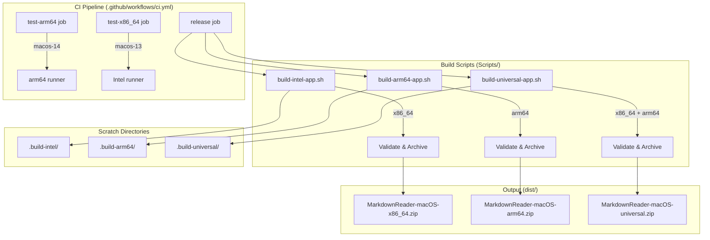
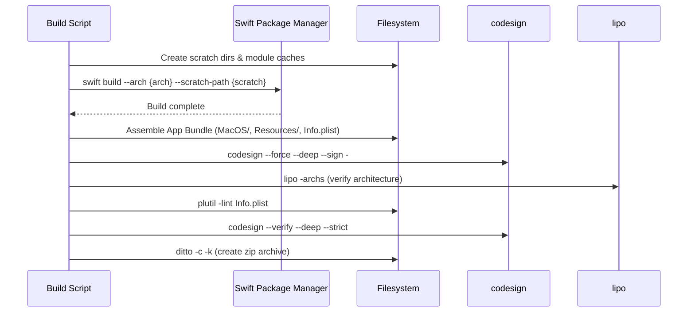
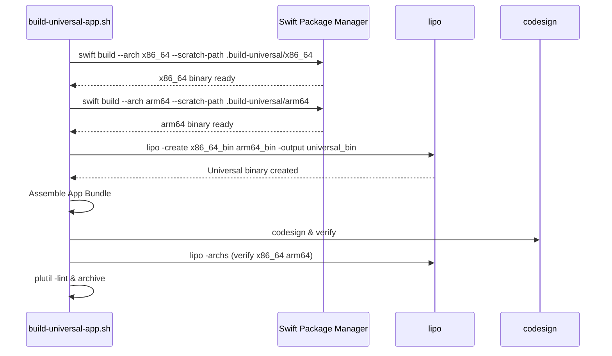

# Design Document: Apple Silicon Support

## Overview

This design adds native Apple Silicon (arm64) build support to the MarkdownReader macOS application. The current build system consists of a single `build-intel-app.sh` script that produces an x86_64-only binary. This design introduces two new build scripts (arm64 and universal), updates the CI pipeline to test and release on both architectures, and establishes build isolation conventions to prevent cross-architecture contamination.

The approach follows the existing script-based build pattern rather than introducing a new build tool (e.g., Fastlane or Makefile). Each architecture gets its own script with its own scratch directory, module caches, and output artifacts. The universal build compiles both architectures independently and merges them with `lipo`.

### Key Design Decisions

1. **Script-per-architecture pattern** — Each build variant (arm64, x86_64, universal) gets its own standalone shell script rather than a parameterized multi-architecture script. This keeps each script simple, debuggable, and independently executable. The universal script orchestrates calling the two architecture-specific builds internally.

2. **Dedicated scratch directories** — Each script uses a distinct `.build-{variant}` directory (`.build-intel`, `.build-arm64`, `.build-universal`) so parallel or sequential builds never share state.

3. **Validation before archiving** — All scripts perform a three-step validation sequence (architecture check, plist lint, codesign verification) before creating the zip archive. Validation fails fast on the first error.

4. **GitHub Actions matrix for architecture testing** — CI tests run as independent jobs per architecture using appropriate runners (`macos-14` for arm64, `macos-13` for x86_64).

## Architecture



### Build Flow (per architecture)



### Universal Build Flow



## Components and Interfaces

### 1. `Scripts/build-arm64-app.sh`

A new shell script that mirrors the structure of `build-intel-app.sh` but targets arm64.

| Aspect | Value |
|--------|-------|
| Scratch path | `.build-arm64` |
| Architecture | `arm64` |
| Output archive | `dist/MarkdownReader-macOS-arm64.zip` |
| Module caches | `.build-arm64/clang-module-cache`, `.build-arm64/swift-module-cache`, `.build-arm64/cache` |

**Interface (CLI):**
```bash
./Scripts/build-arm64-app.sh
# Exit 0 on success, non-zero on failure
# Produces: dist/MarkdownReader-macOS-arm64.zip
```

### 2. `Scripts/build-universal-app.sh`

A new shell script that builds both architectures and merges them.

| Aspect | Value |
|--------|-------|
| Scratch path | `.build-universal` (with sub-dirs `x86_64/` and `arm64/`) |
| Architectures | `x86_64`, `arm64` |
| Output archive | `dist/MarkdownReader-macOS-universal.zip` |
| Module caches | Per-architecture under `.build-universal/{arch}/` |

**Interface (CLI):**
```bash
./Scripts/build-universal-app.sh
# Exit 0 on success, non-zero on failure
# Produces: dist/MarkdownReader-macOS-universal.zip
```

### 3. `Scripts/build-intel-app.sh` (unchanged)

The existing script remains completely unmodified. It continues to use `.build-intel` as its scratch directory and produces `dist/MarkdownReader-macOS-x86_64.zip`.

### 4. CI Pipeline Updates (`.github/workflows/ci.yml`)

The CI workflow gains:
- **Architecture-specific test jobs**: `test-arm64` (on `macos-14`) and `test-x86_64` (on `macos-13`), running independently so one failure doesn't block the other.
- **Release build job**: On `release` events, calls all three build scripts and uploads each zip as a release artifact with 30-day retention.

### 5. Validation Module (shared logic)

Each script embeds the same three-step validation sequence. The logic is inline (not extracted to a shared file) to keep each script self-contained per Requirement 4's isolation principle.

**Validation steps (in order, fail-fast):**
1. `lipo -archs` — verify expected architecture(s)
2. `plutil -lint` — verify Info.plist structure
3. `codesign --verify --deep --strict` — verify code signature

## Data Models

### Directory Layout

```
MarkdownReader/
├── Scripts/
│   ├── build-intel-app.sh          # Existing, unchanged
│   ├── build-arm64-app.sh          # New
│   └── build-universal-app.sh      # New
├── Packaging/
│   └── Info.plist                   # Shared across all variants
├── dist/                            # Build outputs
│   ├── MarkdownReader-macOS-x86_64.zip
│   ├── MarkdownReader-macOS-arm64.zip
│   └── MarkdownReader-macOS-universal.zip
├── .build-intel/                    # Intel scratch (existing)
├── .build-arm64/                    # arm64 scratch (new)
├── .build-universal/                # Universal scratch (new)
│   ├── x86_64/                      # x86_64 sub-build
│   └── arm64/                       # arm64 sub-build
└── .github/workflows/ci.yml        # Updated pipeline
```

### App Bundle Structure (all variants)

```
Markdown Reader.app/
├── Contents/
│   ├── MacOS/
│   │   └── MarkdownReader-macOS    # Architecture-specific or universal binary
│   ├── Resources/
│   │   └── *.bundle                # Resource bundles from build output
│   └── Info.plist                  # Copied from Packaging/Info.plist
```

### Build Script Environment Variables

Each script sets these environment variables scoped to its own scratch path:

| Variable | Purpose | Example (arm64) |
|----------|---------|-----------------|
| `CLANG_MODULE_CACHE_PATH` | Clang module cache isolation | `.build-arm64/clang-module-cache` |
| `SWIFTPM_MODULECACHE_OVERRIDE` | SwiftPM module cache isolation | `.build-arm64/swift-module-cache` |
| `XDG_CACHE_HOME` | XDG cache isolation | `.build-arm64/cache` |

### CI Artifact Naming

| Build Variant | Artifact Name | Archive Filename |
|--------------|---------------|------------------|
| Intel | `macOS-x86_64-release` | `MarkdownReader-macOS-x86_64.zip` |
| arm64 | `macOS-arm64-release` | `MarkdownReader-macOS-arm64.zip` |
| Universal | `macOS-universal-release` | `MarkdownReader-macOS-universal.zip` |

## Error Handling

### Build Script Error Strategy

All build scripts use `set -euo pipefail` (inherited from the existing Intel script) which provides:
- `set -e`: Exit immediately on any non-zero command exit status
- `set -u`: Treat unset variables as errors
- `set -o pipefail`: Pipe failure propagates the error code

### Validation Failure Handling

The validation sequence is fail-fast. Each step checks the result and exits immediately if it fails:

| Validation Step | Failure Condition | Error Output | Exit Code |
|----------------|-------------------|--------------|-----------|
| Architecture check | `lipo -archs` output doesn't match expected | "Expected {expected} executable, found: {actual}" to stderr | 1 |
| Plist lint | `plutil -lint` returns non-zero | plutil's own error message | 1 |
| Code signature | `codesign --verify` returns non-zero | "Code signature verification failed" to stderr | 1 |

### Universal Build Specific Errors

| Failure Condition | Error Output | Exit Code |
|-------------------|--------------|-----------|
| x86_64 build fails | "x86_64 build failed" to stderr | 1 |
| arm64 build fails | "arm64 build failed" to stderr | 1 |
| `lipo -create` fails | "Failed to create universal binary" to stderr | 1 |

### CI Pipeline Error Isolation

- Architecture-specific test jobs run independently. A failure in `test-arm64` does not cancel or fail `test-x86_64` (and vice versa).
- The `strategy.fail-fast: false` matrix option ensures all architecture variants complete regardless of individual failures.
- Each job name includes the architecture for clear failure attribution in the GitHub Actions UI.

## Correctness Properties

*A property is a characteristic or behavior that should hold true across all valid executions of a system — essentially, a formal statement about what the system should do. Properties serve as the bridge between human-readable specifications and machine-verifiable correctness guarantees.*

### Why Property-Based Testing Does Not Apply

This feature consists of shell scripts and CI pipeline configuration. The inputs to these scripts are fixed (no user-provided parameters that vary), and each script has exactly one execution path per invocation. There are no pure functions, no data transformations, and no meaningful input space to generate random values from. Running these scripts 100 times with different inputs is neither possible nor valuable — they operate on the same source tree and produce the same outputs each time.

Per the decision guide:
1. **Does behavior vary meaningfully with input?** — No. Each script always builds the same product for a fixed architecture.
2. **Are you testing YOUR code or external services?** — The scripts orchestrate external tools (`swift build`, `codesign`, `lipo`).
3. **Would 100 iterations find more bugs than 2-3?** — No.

Therefore, property-based testing is not applicable. The correctness of this feature is best verified through integration tests that execute each script and assert observable postconditions (architecture slices, bundle structure, exit codes). The following properties are expressed as integration-verifiable invariants rather than property-based tests.

### Property 1: Architecture slice correctness

*For any* build script execution, the produced binary's architecture (as reported by `lipo -archs`) SHALL exactly match the expected architecture set for that script: "arm64" for the arm64 script, "x86_64" for the Intel script, and "x86_64 arm64" for the universal script.

**Validates: Requirements 1.6, 2.6, 5.2, 6.1**

### Property 2: Build isolation

*For any* pair of build scripts executed in any order, the output of each script SHALL be architecture-correct and independent — no script reads from or writes to another script's scratch directory, and sequential execution in any order produces valid results.

**Validates: Requirements 4.1, 4.3, 4.4, 5.4**

### Property 3: Validation fail-fast

*For any* build script execution where a validation step fails, the script SHALL exit with a non-zero status code immediately without executing subsequent validation steps, and SHALL output a diagnostic message identifying the failure.

**Validates: Requirements 1.7, 2.7, 2.9, 6.2, 6.5**

### Property 4: App Bundle structural completeness

*For any* successful build script execution, the produced App Bundle SHALL contain exactly three structural components: an executable at `Contents/MacOS/`, an `Info.plist` at `Contents/`, and resource bundles (if present in build output) at `Contents/Resources/`.

**Validates: Requirements 1.2, 2.3, 5.2**

## Testing Strategy

### Why Property-Based Testing Does Not Apply

This feature consists of shell scripts and CI pipeline configuration. The "code" under test is:
- Shell scripts that orchestrate external tools (`swift build`, `codesign`, `lipo`, `plutil`, `ditto`)
- CI workflow YAML configuration
- File system operations (directory creation, file copying)

There are no pure functions, no data transformations, and no input space to vary meaningfully. PBT requires universal properties over a range of inputs — these scripts have exactly one execution path per invocation. The correct testing approach is integration tests that execute the scripts and verify their outputs.

### Testing Approach

#### 1. Integration Tests (Primary)

Execute each build script in a real environment and verify outputs:

| Test | Verification |
|------|-------------|
| arm64 script produces correct binary | Run script, check `lipo -archs` output equals "arm64" |
| Universal script produces fat binary | Run script, check `lipo -archs` output contains "x86_64 arm64" |
| Intel script still works | Run script, check `lipo -archs` output equals "x86_64" |
| App bundle structure is correct | Verify `Contents/MacOS/`, `Contents/Resources/`, `Contents/Info.plist` exist |
| Archive is created | Verify `.zip` file exists in `dist/` and is a valid zip |
| Resource bundles are included | Build with resources, verify `*.bundle` dirs in `Contents/Resources/` |

#### 2. Isolation Tests

Verify that architecture builds don't interfere:

| Test | Verification |
|------|-------------|
| Sequential builds produce correct results | Run arm64 then Intel (and reverse), verify each output is architecture-correct |
| Scratch directories are separate | After both builds, verify `.build-arm64/` and `.build-intel/` have no overlapping content |
| No cross-contamination | Run universal build, then Intel build — Intel output must be x86_64 only |

#### 3. Failure Mode Tests

Verify error handling works correctly:

| Test | Verification |
|------|-------------|
| Missing swift toolchain | Script exits non-zero with meaningful error |
| Invalid Info.plist | Validation fails at plutil step, exits non-zero |
| Corrupted binary | Architecture verification fails, exits non-zero |

#### 4. CI Pipeline Tests

Validate the workflow configuration:

| Test | Verification |
|------|-------------|
| Workflow YAML is valid | `actionlint` or GitHub's workflow validator passes |
| Architecture jobs are independent | `fail-fast: false` is set in test matrix |
| Release artifacts have correct names | Artifact names include architecture identifier |
| Retention is configured | `retention-days: 30` is set on upload steps |

#### 5. Smoke Tests

Quick checks to run on every PR:

| Test | Verification |
|------|-------------|
| Scripts are executable | `test -x Scripts/build-arm64-app.sh` |
| Scripts have correct shebang | First line is `#!/bin/bash` |
| Intel script is unchanged | `git diff --name-only` shows no modifications to `build-intel-app.sh` |
| Required directories/files referenced exist | `Packaging/Info.plist` exists |

