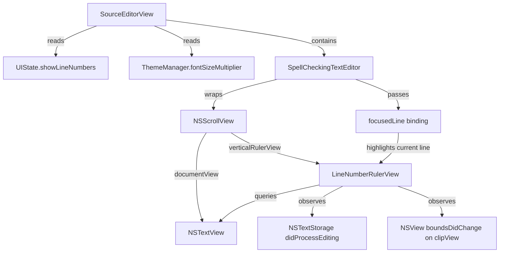

# Design Document: HTML Source Line Numbers

## Overview

This feature adds a line number gutter to the `SourceEditorView` — the NSTextView-based editor used when viewing HTML documents in source mode. The implementation leverages the existing `UIState.showLineNumbers` toggle and follows visual patterns already established in the Markdown formatted content view (11pt monospaced font, gray at 0.4 opacity, 36pt gutter width, right-aligned numbers).

The core technical challenge is implementing a performant line number gutter alongside an `NSTextView` wrapped in `NSViewRepresentable`. Unlike the Markdown view (which uses SwiftUI `VStack`/`ForEach` to render line-by-line), the `SourceEditorView` uses AppKit's text system. The gutter must synchronize with `NSTextView`'s layout manager to handle word-wrapped lines, variable-height text, and scrolling.

### Design Decisions

1. **NSRulerView approach**: We use a custom `NSRulerView` subclass attached to the `NSScrollView` that already wraps the `NSTextView`. This is the idiomatic AppKit pattern for line number gutters — it scrolls in sync automatically, stays fixed horizontally, and receives layout notifications from the text system.

2. **Reuse existing state path**: The `UIState.showLineNumbers` property and `ThemeManager.fontSizeMultiplier` are already plumbed through the view hierarchy. The `SpellCheckingTextEditor` already reads these via its parent's environment.

3. **Ruler-based current line tracking**: The coordinator already tracks `focusedLine` via `textViewDidChangeSelection`. We pass this to the ruler view so it can highlight the current line number in the accent color.

## Architecture



The `LineNumberRulerView` is an `NSRulerView` subclass that:
- Attaches to the `NSScrollView`'s `verticalRulerView` slot
- Draws line numbers by iterating through the `NSLayoutManager`'s line fragment rects
- Redraws on text edits (`NSTextStorage.didProcessEditingNotification`) and scrolls (`NSView.boundsDidChangeNotification` on the clip view)
- Highlights the current line number using the system accent color at full opacity while other numbers render at 0.4 opacity

## Components and Interfaces

### LineNumberRulerView (New)

A custom `NSRulerView` subclass responsible for drawing line numbers.

```swift
final class LineNumberRulerView: NSRulerView {
    // MARK: - Configuration
    var font: NSFont
    var textColor: NSColor        // Base color (gray at 0.4 opacity)
    var currentLineColor: NSColor // System accent color, full opacity
    var currentLine: Int?         // 1-indexed line number to highlight
    var separatorColor: NSColor   // 1pt vertical rule color

    // MARK: - Lifecycle
    init(scrollView: NSScrollView, textView: NSTextView)
    
    // MARK: - Public API
    func updateFontSize(_ size: CGFloat)
    func updateCurrentLine(_ line: Int?)

    // MARK: - Drawing
    override var requiredThickness: CGFloat  // Dynamic width based on digit count
    override func drawHashMarksAndLabels(in rect: NSRect)

    // MARK: - Private
    private func lineCount() -> Int
    private func registerNotifications()
    private func handleTextChange(_ notification: Notification)
    private func handleScrollChange(_ notification: Notification)
}
```

### SpellCheckingTextEditor (Modified)

Extended to accept line number configuration and manage the ruler view lifecycle.

```swift
struct SpellCheckingTextEditor: NSViewRepresentable {
    // Existing properties...
    @Binding var text: String
    @Binding var focusedLine: Int?
    var fontSize: CGFloat
    var spellCheckingEnabled: Bool
    
    // New properties
    var showLineNumbers: Bool
    var lineNumberFontSize: CGFloat  // 11 * fontSizeMultiplier
    
    // Coordinator gains ruler management
    class Coordinator: NSObject, NSTextViewDelegate {
        var rulerView: LineNumberRulerView?
        // ...existing coordinator code...
    }
}
```

### SourceEditorView (Modified)

Passes the `showLineNumbers` and font size multiplier settings to `SpellCheckingTextEditor`.

```swift
private var editorArea: some View {
    SpellCheckingTextEditor(
        text: $editedContent,
        focusedLine: /* ... */,
        fontSize: 13 * themeManager.fontSizeMultiplier,
        spellCheckingEnabled: /* ... */,
        showLineNumbers: coordinator.uiState.showLineNumbers,
        lineNumberFontSize: 11 * themeManager.fontSizeMultiplier
    )
}
```

## Data Models

No new data models are required. The feature uses existing state:

| Property | Type | Location | Purpose |
|----------|------|----------|---------|
| `showLineNumbers` | `Bool` | `UIState` | Toggle visibility of the line number gutter |
| `fontSizeMultiplier` | `CGFloat` | `ThemeManager` | Scales the 11pt base font for line numbers |
| `focusedLine` | `Int?` | `DocumentState` | Tracks current cursor line for highlighting |

The `LineNumberRulerView` maintains internal drawing state (cached line count, computed gutter width) but these are transient rendering concerns, not persisted data.


## Correctness Properties

*A property is a characteristic or behavior that should hold true across all valid executions of a system — essentially, a formal statement about what the system should do. Properties serve as the bridge between human-readable specifications and machine-verifiable correctness guarantees.*

### Property 1: Line count equals newlines plus one

*For any* non-empty string, the computed line count SHALL equal the number of newline characters (`\n`) in the string plus one. For the empty string, the line count SHALL be 1. The generated line number sequence SHALL always be the contiguous integers `[1, 2, ..., N]` where N is the line count.

**Validates: Requirements 1.3**

### Property 2: Gutter width accommodates digit count with minimum of two digits

*For any* line count N ≥ 1, the computed gutter width SHALL be sufficient to display `max(2, floor(log10(N)) + 1)` digits at the configured font size, plus the required padding. The width SHALL never be less than the width required for 2-digit numbers.

**Validates: Requirements 2.2**

### Property 3: Toggle preserves document state

*For any* text content and any cursor position within that content, toggling `showLineNumbers` from any state to the opposite state SHALL result in the text content being identical before and after the toggle, and the cursor position (character index) being unchanged.

**Validates: Requirements 5.3**

### Property 4: Font size scales linearly with multiplier

*For any* font size multiplier value M in the range [0.5, 3.0], the displayed line number font size SHALL equal exactly `11.0 * M` points.

**Validates: Requirements 6.2**

## Error Handling

| Scenario | Handling |
|----------|----------|
| Empty document (0 lines) | Display gutter with line number "1" (a single empty line still counts as one line) |
| Extremely long document (100k+ lines) | `requiredThickness` recalculates dynamically; the ruler redraws only visible lines using `NSLayoutManager` line fragment enumeration within the visible rect |
| Font size multiplier at extremes (0.5x or 3.0x) | Gutter width recalculates based on actual character widths at the scaled font size; minimum width still enforced |
| Text view not yet laid out | Guard against nil `layoutManager` / `textContainer` in `drawHashMarksAndLabels`; skip drawing if layout is incomplete |
| Rapid toggling of setting | Each toggle simply shows/hides the ruler; no document reload or layout invalidation beyond ruler thickness change |
| Document switch while gutter is visible | `updateNSView` re-evaluates `showLineNumbers`; ruler survives document switches since it's attached to the scroll view, not the text content |

## Testing Strategy

### Unit Tests (XCTest)

Unit tests verify specific configurations and edge cases:

- **Ruler installation**: When `showLineNumbers` is true and document format is HTML, verify the scroll view has a non-nil `verticalRulerView` of type `LineNumberRulerView`.
- **Ruler removal**: When `showLineNumbers` is false, verify the ruler is nil or the scroll view's `rulersVisible` is false.
- **Font configuration**: Verify the ruler's font is `NSFont.monospacedSystemFont` at the expected size.
- **Color configuration**: Verify the base text color has alpha ≤ 0.5, and the current line color uses the accent color at full opacity.
- **Current line highlighting**: Set `currentLine` to a value, verify the ruler uses the accent color for that line number in its drawing.
- **Focus loss behavior**: Set `currentLine`, simulate focus loss (without changing currentLine), verify highlight persists.
- **Multi-line selection**: Set a selection spanning multiple lines, verify only the insertion point line is highlighted.
- **Separator drawing**: Verify the 1pt vertical rule is drawn at the trailing edge.
- **Consistency check**: Verify base font size is 11pt, gutter width is 36pt, matching the Markdown view constants.

### Property-Based Tests (SwiftCheck or swift-testing with randomization)

Property-based tests verify universal correctness properties with a minimum of 100 iterations each:

- **Property 1: Line count** — Generate random strings (varying lengths, varying newline counts, including edge cases like trailing newlines, consecutive newlines, empty strings), verify line count = `components(separatedBy: "\n").count`.
  - Tag: `Feature: html-source-line-numbers, Property 1: Line count equals newlines plus one`

- **Property 2: Gutter width** — Generate random line counts in [1, 999999], compute expected digit count as `max(2, String(lineCount).count)`, verify the `requiredThickness` produces a width that accommodates that many characters plus padding.
  - Tag: `Feature: html-source-line-numbers, Property 2: Gutter width accommodates digit count with minimum of two digits`

- **Property 3: Toggle preserves state** — Generate random text content (various lengths, Unicode, mixed line endings), set a random valid cursor position, toggle `showLineNumbers`, verify text and cursor are unchanged.
  - Tag: `Feature: html-source-line-numbers, Property 3: Toggle preserves document state`

- **Property 4: Font size scaling** — Generate random multiplier values in [0.5, 3.0], verify computed font size equals `11.0 * multiplier` within floating-point tolerance.
  - Tag: `Feature: html-source-line-numbers, Property 4: Font size scales linearly with multiplier`

### Integration Tests

- **Scroll synchronization**: Programmatically scroll the text view, verify the ruler's drawn line numbers correspond to visible lines (NSRulerView guarantees this architecturally, but a smoke test confirms the wiring).
- **Dynamic width update**: Start with a 9-line document, add lines until it crosses 100, verify `requiredThickness` increases.
- **Real-time toggle**: With a loaded HTML document, toggle `showLineNumbers` on/off, verify no text content or scroll position changes.

### Test Configuration

- Property-based tests: minimum 100 iterations per property
- Testing library: Swift's built-in XCTest with custom generators, or SwiftCheck if available in the project
- All tests run on `@MainActor` since they interact with AppKit views
