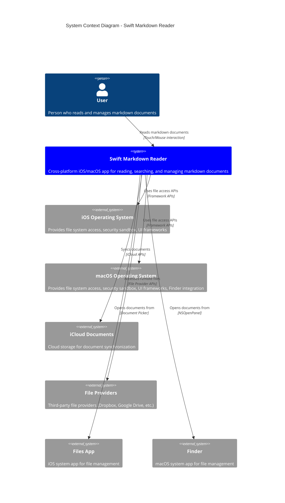
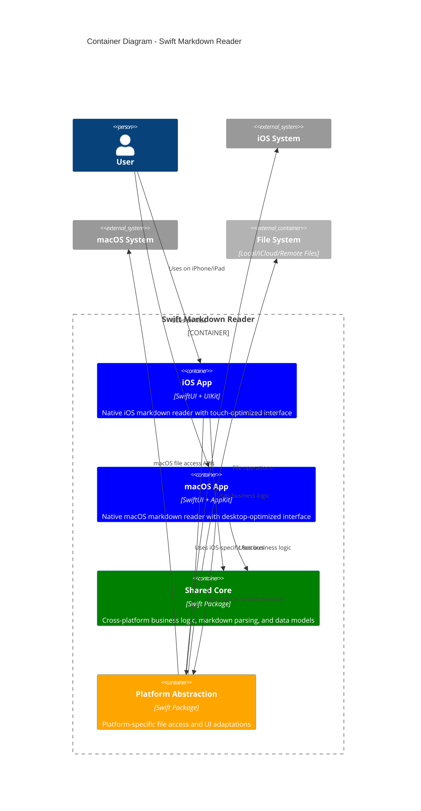
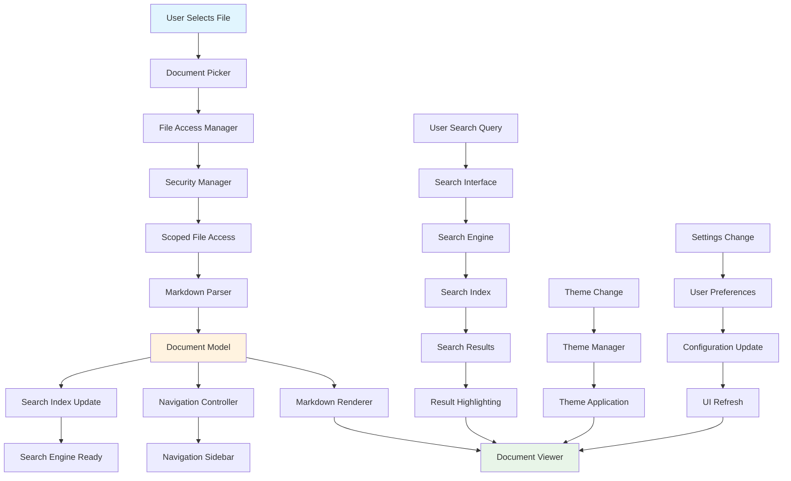

# C4 Model - Swift Markdown Reader

## Context Diagram (Level 1)

```mermaid
C4Context
    title System Context Diagram - Swift Markdown Reader

    Person(user, "User", "Person who reads and manages markdown documents")

    System(markdownReader, "Swift Markdown Reader", "Cross-platform iOS/macOS app for reading, searching, and managing markdown documents")

    System_Ext(iOS, "iOS Operating System", "Provides file system access, security sandbox, UI frameworks")
    System_Ext(macOS, "macOS Operating System", "Provides file system access, security sandbox, UI frameworks, Finder integration")
    System_Ext(iCloudDocs, "iCloud Documents", "Cloud storage for document synchronization")
    System_Ext(fileProviders, "File Providers", "Third-party file providers (Dropbox, Google Drive, etc.)")
    System_Ext(documentsApp, "Files App", "iOS system app for file management")
    System_Ext(finder, "Finder", "macOS system app for file management")

    Rel(user, markdownReader, "Reads markdown documents", "Touch/Mouse interaction")
    Rel(markdownReader, iOS, "Uses file access APIs", "Framework APIs")
    Rel(markdownReader, macOS, "Uses file access APIs", "Framework APIs")
    Rel(markdownReader, iCloudDocs, "Syncs documents", "iCloud APIs")
    Rel(markdownReader, fileProviders, "Accesses remote files", "File Provider APIs")
    Rel(markdownReader, documentsApp, "Opens documents from", "Document Picker")
    Rel(markdownReader, finder, "Opens documents from", "NSOpenPanel")

    UpdateElementStyle(markdownReader, $fontColor="white", $bgColor="blue")
```

## Container Diagram (Level 2)

```mermaid
C4Container
    title Container Diagram - Swift Markdown Reader

    Person(user, "User")

    Container_Boundary(app, "Swift Markdown Reader") {
        Container(iOSApp, "iOS App", "SwiftUI + UIKit", "Native iOS markdown reader with touch-optimized interface")
        Container(macOSApp, "macOS App", "SwiftUI + AppKit", "Native macOS markdown reader with desktop-optimized interface")
        Container(sharedCore, "Shared Core", "Swift Package", "Cross-platform business logic, markdown parsing, and data models")
        Container(platformAbstraction, "Platform Abstraction", "Swift Package", "Platform-specific file access and UI adaptations")
    }

    System_Ext(iOSSystem, "iOS System")
    System_Ext(macOSSystem, "macOS System")
    Container_Ext(fileSystem, "File System", "Local/iCloud/Remote Files")

    Rel(user, iOSApp, "Uses on iPhone/iPad")
    Rel(user, macOSApp, "Uses on Mac")

    Rel(iOSApp, sharedCore, "Uses business logic")
    Rel(macOSApp, sharedCore, "Uses business logic")

    Rel(iOSApp, platformAbstraction, "Uses iOS-specific features")
    Rel(macOSApp, platformAbstraction, "Uses macOS-specific features")

    Rel(platformAbstraction, iOSSystem, "iOS file access APIs")
    Rel(platformAbstraction, macOSSystem, "macOS file access APIs")
    Rel(platformAbstraction, fileSystem, "File operations")

    UpdateElementStyle(iOSApp, $fontColor="white", $bgColor="blue")
    UpdateElementStyle(macOSApp, $fontColor="white", $bgColor="blue")
    UpdateElementStyle(sharedCore, $fontColor="white", $bgColor="green")
    UpdateElementStyle(platformAbstraction, $fontColor="white", $bgColor="orange")
```

## Component Diagram (Level 3)

```mermaid
C4Component
    title Component Diagram - Swift Markdown Reader Shared Core

    Container_Boundary(sharedCore, "Shared Core Package") {
        Component(markdownParser, "Markdown Parser", "Swift", "Parses markdown text into structured document model")
        Component(markdownRenderer, "Markdown Renderer", "Swift", "Renders document model to AttributedString for display")
        Component(documentModel, "Document Model", "Swift", "Core data structures for markdown documents")
        Component(searchEngine, "Search Engine", "Swift", "Full-text search and indexing functionality")
        Component(searchIndex, "Search Index", "Swift", "In-memory search index for fast document searches")
        Component(navigationController, "Navigation Controller", "Swift", "Document outline and heading navigation")
        Component(recentFiles, "Recent Files Manager", "Swift", "Tracks and manages recently opened documents")
        Component(userPreferences, "User Preferences", "Swift", "App settings and user configuration")
        Component(themeManager, "Theme Manager", "Swift", "Manages reading themes and appearance settings")
        Component(featureToggles, "Feature Toggles", "Swift", "Runtime feature flag management")
    }

    Container_Boundary(platformAbstraction, "Platform Abstraction Package") {
        Component(fileAccessManager, "File Access Manager", "Swift", "Abstracts platform-specific file operations")
        Component(documentPicker, "Document Picker", "Swift", "Platform-specific document selection interface")
        Component(securityManager, "Security Manager", "Swift", "Manages file access permissions and security scopes")
        Component(platformUI, "Platform UI Adapters", "Swift", "Platform-specific UI component adaptations")
    }

    Container_Boundary(viewerUI, "Viewer UI Package") {
        Component(documentViewer, "Document Viewer", "SwiftUI", "Main document display and interaction")
        Component(navigationSidebar, "Navigation Sidebar", "SwiftUI", "Document outline and structure navigation")
        Component(searchInterface, "Search Interface", "SwiftUI", "Search input and results display")
        Component(settingsView, "Settings View", "SwiftUI", "User preferences and configuration interface")
        Component(themeSelector, "Theme Selector", "SwiftUI", "Reading theme selection and preview")
    }

    Container_Ext(fileSystem, "File System")

    Rel(documentViewer, markdownRenderer, "Gets rendered content")
    Rel(markdownRenderer, documentModel, "Uses document structure")
    Rel(markdownParser, documentModel, "Creates document model")
    Rel(navigationSidebar, navigationController, "Gets document outline")
    Rel(navigationController, documentModel, "Analyzes document structure")
    Rel(searchInterface, searchEngine, "Performs searches")
    Rel(searchEngine, searchIndex, "Queries search index")
    Rel(searchIndex, documentModel, "Indexes document content")
    Rel(documentViewer, themeManager, "Applies themes")
    Rel(settingsView, userPreferences, "Manages settings")
    Rel(settingsView, featureToggles, "Controls features")
    Rel(fileAccessManager, securityManager, "Manages permissions")
    Rel(fileAccessManager, fileSystem, "File operations")
    Rel(documentPicker, fileAccessManager, "Selects files")
    Rel(recentFiles, fileAccessManager, "Tracks opened files")

    UpdateElementStyle(markdownParser, $fontColor="white", $bgColor="green")
    UpdateElementStyle(markdownRenderer, $fontColor="white", $bgColor="green")
    UpdateElementStyle(documentModel, $fontColor="white", $bgColor="green")
    UpdateElementStyle(searchEngine, $fontColor="white", $bgColor="orange")
    UpdateElementStyle(documentViewer, $fontColor="white", $bgColor="blue")
    UpdateElementStyle(navigationSidebar, $fontColor="white", $bgColor="blue")
```

## Data Flow Architecture

```mermaid
flowchart TD
    A[User Selects File] --> B[Document Picker]
    B --> C[File Access Manager]
    C --> D[Security Manager]
    D --> E[Scoped File Access]
    E --> F[Markdown Parser]
    F --> G[Document Model]
    G --> H[Search Index Update]
    G --> I[Navigation Controller]
    G --> J[Markdown Renderer]
    J --> K[Document Viewer]
    I --> L[Navigation Sidebar]
    H --> M[Search Engine Ready]

    N[User Search Query] --> O[Search Interface]
    O --> P[Search Engine]
    P --> Q[Search Index]
    Q --> R[Search Results]
    R --> S[Result Highlighting]
    S --> K

    T[Theme Change] --> U[Theme Manager]
    U --> V[Theme Application]
    V --> K

    W[Settings Change] --> X[User Preferences]
    X --> Y[Configuration Update]
    Y --> Z[UI Refresh]
    Z --> K

    style A fill:#e1f5fe
    style K fill:#e8f5e8
    style G fill:#fff3e0
```