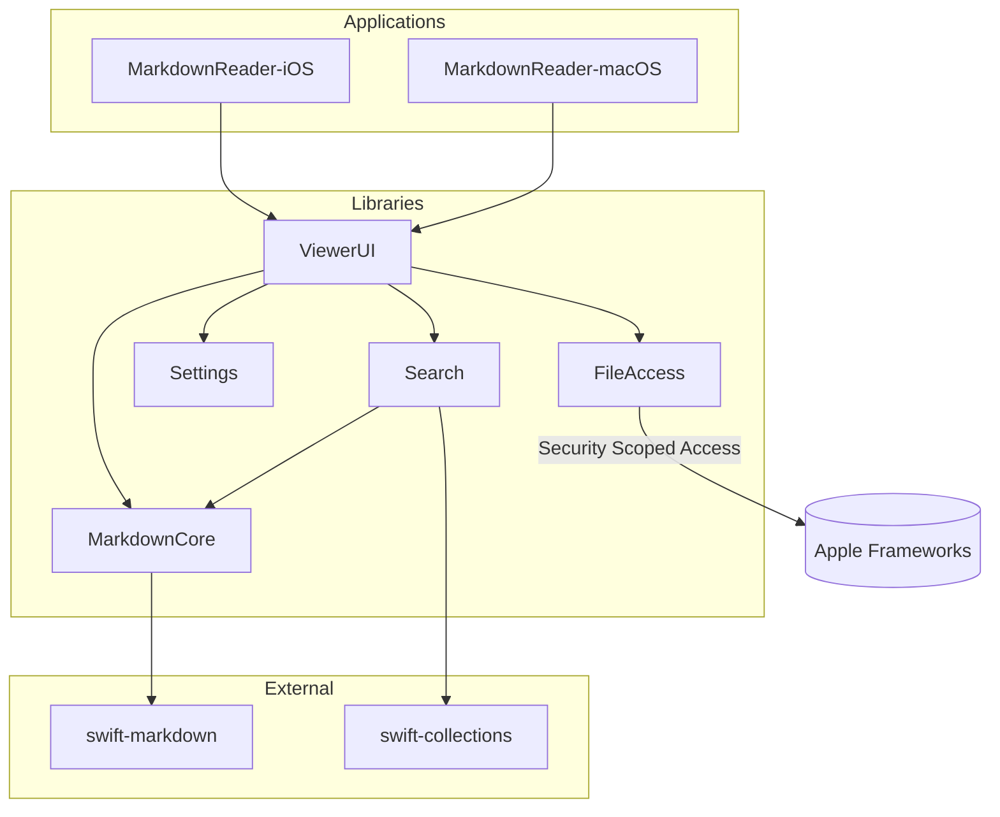

# Module Dependencies and Specifications

This document captures the current module structure for the MarkdownReader project as of October 2025. It reflects the feature work completed for markdown editing, scoped search (current tab and all tabs), and the revamped settings surface.

## Architecture Overview
- Swift Package `SwiftMarkdownReader` delivers one macOS and one iOS executable plus five library targets (`MarkdownCore`, `ViewerUI`, `FileAccess`, `Search`, `Settings`).
- All library targets compile with Swift's `StrictConcurrency` experimental feature enabled to enforce Sendable correctness in shared state types.
- `ViewerUI` coordinates UI flows through the `AppStateCoordinator`, which bridges UI state to the core services in the other four libraries.
- External dependencies are limited to the Swift open-source `swift-markdown` and `swift-collections` packages.



## Package.swift Snapshot
```swift
// swift-tools-version: 5.9
import PackageDescription

let package = Package(
    name: "SwiftMarkdownReader",
    platforms: [
        .macOS(.v14),
        .iOS(.v17)
    ],
    products: [
        .executable(name: "MarkdownReader-iOS", targets: ["MarkdownReader-iOS"]),
        .executable(name: "MarkdownReader-macOS", targets: ["MarkdownReader-macOS"]),
        .library(name: "MarkdownCore", targets: ["MarkdownCore"]),
        .library(name: "ViewerUI", targets: ["ViewerUI"]),
        .library(name: "FileAccess", targets: ["FileAccess"]),
        .library(name: "Search", targets: ["Search"]),
        .library(name: "Settings", targets: ["Settings"])
    ],
    dependencies: [
        .package(url: "https://github.com/swiftlang/swift-markdown.git", from: "0.3.0"),
        .package(url: "https://github.com/apple/swift-collections.git", from: "1.1.0")
    ],
    targets: [
        .executableTarget(
            name: "MarkdownReader-iOS",
            dependencies: ["MarkdownCore", "ViewerUI", "FileAccess", "Search", "Settings"],
            path: "Apps/MarkdownReader-iOS"
        ),
        .executableTarget(
            name: "MarkdownReader-macOS",
            dependencies: ["MarkdownCore", "ViewerUI", "FileAccess", "Search", "Settings"],
            path: "Apps/MarkdownReader-macOS"
        ),
        .target(
            name: "MarkdownCore",
            dependencies: [
                .product(name: "Markdown", package: "swift-markdown"),
                .product(name: "OrderedCollections", package: "swift-collections")
            ],
            path: "Packages/MarkdownCore/Sources",
            swiftSettings: [.enableExperimentalFeature("StrictConcurrency")]
        ),
        .target(
            name: "ViewerUI",
            dependencies: ["MarkdownCore", "Search", "Settings"],
            path: "Packages/ViewerUI/Sources",
            swiftSettings: [.enableExperimentalFeature("StrictConcurrency")]
        ),
        .target(
            name: "FileAccess",
            dependencies: [],
            path: "Packages/FileAccess/Sources",
            swiftSettings: [.enableExperimentalFeature("StrictConcurrency")]
        ),
        .target(
            name: "Search",
            dependencies: ["MarkdownCore", .product(name: "OrderedCollections", package: "swift-collections")],
            path: "Packages/Search/Sources",
            swiftSettings: [.enableExperimentalFeature("StrictConcurrency")]
        ),
        .target(
            name: "Settings",
            dependencies: [],
            path: "Packages/Settings/Sources",
            swiftSettings: [.enableExperimentalFeature("StrictConcurrency")]
        ),
        .testTarget(name: "MarkdownCoreTests", dependencies: ["MarkdownCore"], path: "Packages/MarkdownCore/Tests"),
        .testTarget(name: "ViewerUITests", dependencies: ["ViewerUI"], path: "Packages/ViewerUI/Tests"),
        .testTarget(name: "FileAccessTests", dependencies: ["FileAccess"], path: "Packages/FileAccess/Tests"),
        .testTarget(name: "SearchTests", dependencies: ["Search"], path: "Packages/Search/Tests"),
        .testTarget(name: "SettingsTests", dependencies: ["Settings"], path: "Packages/Settings/Tests")
    ]
)
```

## External Dependencies
- `swift-markdown` (`Markdown` product)
  - Used in `MarkdownCore` for CommonMark + GFM parsing and AST traversal.
  - Enables accurate rendering and metadata extraction for the viewer and search index.
- `swift-collections` (`OrderedCollections` product)
  - Used in `MarkdownCore` for stable heading ordering and caching.
  - Used in `Search` for deterministic result ordering across multi-document searches.

## Target Summaries
- **MarkdownReader-iOS / MarkdownReader-macOS**: Thin executables that host the shared SwiftUI content. They wire platform-specific app life-cycle events to the shared coordinator in `ViewerUI`.
- **ViewerUI**: Primary UI surface, composed of SwiftUI scenes and the `AppStateCoordinator` observable object. Hosts document tabs, search panel, markdown editor, and settings console.
- **MarkdownCore**: Parses markdown to attributed strings and structured metadata, produces outline data, and exposes caching helpers consumed by `ViewerUI` and `Search`.
- **Search**: Provides asynchronous search services against the current document or all open tabs. Relies on `MarkdownCore` for tokenization and `OrderedCollections` for result de-duplication.
- **FileAccess**: Manages bookmark resolution and security scoped resource access so edited files can be saved back to disk in sandboxed contexts.
- **Settings**: Encapsulates user preference models, template presets, and JSON import/export helpers used by the settings UI.

## Key Module Interfaces
### ViewerUI
- `AppStateCoordinator`: Observable hub that tracks document tabs, search state, UI presentation toggles, and editing metadata (`uiState.isEditing`, `uiState.hasUnsavedChanges`).
- `MarkdownEditorView`: SwiftUI view hosting the `TextEditor`, save/discard flows, and focus management for keyboard entry.
- `SearchInterface`: Provides search field, history, and scope picker (`searchState.searchScope`). Auto-focus ensures keyboard input works when the panel opens.
- `SettingsView`: Read-only settings snapshot with template application, import/export workflows, and iCloud sync toggles.

### MarkdownCore
- Parsing services built on top of `Markdown` package with concurrency-safe caching.
- Document models expose outline entries, metadata, and attributed rendering consumed by `ViewerUI`.

### Search
- `SearchService`: Async API returning `[SearchResult]` objects referencing the originating document.
- Multi-document search iterates open tabs supplied by `AppStateCoordinator`, filtering and merging results while preserving ordering via `OrderedSet`.

### FileAccess
- Bookmark resolution utilities abstracted behind protocol-oriented wrappers.
- Provides scoped read/write helpers used by `MarkdownEditorView.saveDocument()` to persist edits safely.

### Settings
- Immutable preference structs (theme, accessibility, privacy, performance) plus presets accessed by the settings UI.
- JSON serializer/deserializer to support import/export from both platforms.

## Cross-Module Flows
- **Markdown Editing**: `ViewerUI.MarkdownEditorView` ←→ `AppStateCoordinator` → `FileAccess` for save operations; document reload uses `MarkdownCore` to regenerate rendered content.
- **Search (Current Tab)**: `SearchInterface` → `AppStateCoordinator.performSearch` → `SearchService.search` (targeting `documentState.currentDocument`) → `MarkdownCore` for tokenization.
- **Search (All Tabs)**: `SearchInterface` sets `searchState.searchScope = .allOpenDocuments`; coordinator iterates `tabState.tabs`, invoking `SearchService.search` per document.
- **Settings Templates**: `SettingsView` applies a template by assigning immutable structs from `Settings` to `coordinator.userPreferences`, which propagates updates to dependent SwiftUI views.

## Build & Testing Notes
- All library targets compile with `StrictConcurrency`, reducing data race risk as observed during focus-state fixes in ViewerUI.
- Each module has a dedicated XCTest target. UI behaviors (e.g., markdown editing focus) should be covered by integration tests inside `ViewerUITests`.
- The SwiftPM structure allows the executables to reuse the same library stack; platform divergence lives in the respective `Apps/MarkdownReader-*` folders.

## Maintenance Checklist
- When adding a new service or UI surface, prefer introducing a dedicated package target so cross-platform consumers remain isolated.
- External dependency upgrades should be reflected in both `Package.swift` and this document; validate concurrency annotations after performing updates.
- Keep the `ViewerUI` section aligned with coordinator state mutations to avoid stale documentation around editor/search behavior.
