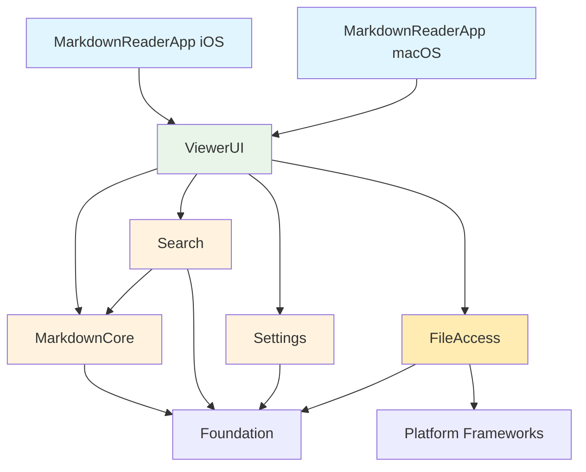

# Module Dependencies and Specifications

## Module Architecture Overview

The Swift Markdown Reader follows a modular architecture with clear separation of concerns and minimal dependencies. The architecture supports cross-platform development while maintaining platform-specific optimizations.



## Swift Package Structure

### Package.swift Configuration
```swift
// swift-tools-version: 5.9
import PackageDescription

let package = Package(
    name: "MarkdownReaderCore",
    platforms: [
        .iOS(.v17),
        .macOS(.v14)
    ],
    products: [
        .library(name: "MarkdownCore", targets: ["MarkdownCore"]),
        .library(name: "ViewerUI", targets: ["ViewerUI"]),
        .library(name: "Search", targets: ["Search"]),
        .library(name: "Settings", targets: ["Settings"]),
        .library(name: "FileAccess", targets: ["FileAccess"])
    ],
    dependencies: [
        // No external dependencies - pure Apple ecosystem
    ],
    targets: [
        // Core business logic
        .target(
            name: "MarkdownCore",
            dependencies: []
        ),

        // Search functionality
        .target(
            name: "Search",
            dependencies: ["MarkdownCore"]
        ),

        // User preferences and settings
        .target(
            name: "Settings",
            dependencies: []
        ),

        // File access abstraction
        .target(
            name: "FileAccess",
            dependencies: []
        ),

        // SwiftUI views and UI components
        .target(
            name: "ViewerUI",
            dependencies: [
                "MarkdownCore",
                "Search",
                "Settings",
                "FileAccess"
            ]
        ),

        // Test targets
        .testTarget(
            name: "MarkdownCoreTests",
            dependencies: ["MarkdownCore"]
        ),
        .testTarget(
            name: "SearchTests",
            dependencies: ["Search"]
        ),
        .testTarget(
            name: "ViewerUITests",
            dependencies: ["ViewerUI"]
        )
    ]
)
```

## Module Specifications

### 1. MarkdownCore Module

**Purpose**: Core markdown parsing, document model, and rendering functionality.

**Dependencies**: Foundation only

**Public Interface**:
```swift
// MARK: - Document Model
public struct DocumentModel: Sendable {
    public let id: UUID
    public let content: String
    public let attributedContent: AttributedString
    public let metadata: DocumentMetadata
    public let structure: DocumentStructure

    public init(content: String) throws
}

public struct DocumentMetadata: Sendable, Codable {
    public let wordCount: Int
    public let characterCount: Int
    public let readingTime: TimeInterval
    public let lastModified: Date
    public let fileSize: Int64
}

public struct DocumentStructure: Sendable {
    public let headers: [HeaderElement]
    public let codeBlocks: [CodeBlockElement]
    public let links: [LinkElement]
    public let tables: [TableElement]
}

// MARK: - Parser Protocol
public protocol MarkdownParser: Sendable {
    func parse(_ markdown: String) async throws -> DocumentModel
    func supportedFeatures() -> Set<MarkdownFeature>
}

public class NativeMarkdownParser: MarkdownParser {
    public init() {}
    public func parse(_ markdown: String) async throws -> DocumentModel
    public func supportedFeatures() -> Set<MarkdownFeature>
}

// MARK: - Renderer Protocol
public protocol MarkdownRenderer: Sendable {
    func render(_ document: DocumentModel) async -> AttributedString
    func render(_ document: DocumentModel, with theme: RenderingTheme) async -> AttributedString
}

public class NativeMarkdownRenderer: MarkdownRenderer {
    public init() {}
    public func render(_ document: DocumentModel) async -> AttributedString
    public func render(_ document: DocumentModel, with theme: RenderingTheme) async -> AttributedString
}
```

**Internal Structure**:
```
Sources/MarkdownCore/
├── Models/
│   ├── DocumentModel.swift
│   ├── DocumentMetadata.swift
│   ├── DocumentStructure.swift
│   └── MarkdownElements.swift
├── Parsing/
│   ├── MarkdownParser.swift
│   ├── NativeMarkdownParser.swift
│   ├── MarkdownFeature.swift
│   └── ParsingError.swift
├── Rendering/
│   ├── MarkdownRenderer.swift
│   ├── NativeMarkdownRenderer.swift
│   ├── RenderingTheme.swift
│   └── AttributedStringBuilder.swift
└── Extensions/
    ├── String+Markdown.swift
    └── AttributedString+Extensions.swift
```

### 2. Search Module

**Purpose**: Full-text search, indexing, and result management functionality.

**Dependencies**: MarkdownCore, Foundation

**Public Interface**:
```swift
// MARK: - Search Engine
public protocol SearchEngine: Sendable {
    func indexDocument(_ document: DocumentModel) async throws
    func search(_ query: String) async throws -> [SearchResult]
    func clearIndex() async
}

public actor MarkdownSearchEngine: SearchEngine {
    public init()
    public func indexDocument(_ document: DocumentModel) async throws
    public func search(_ query: String) async throws -> [SearchResult]
    public func clearIndex() async
}

// MARK: - Search Results
public struct SearchResult: Sendable, Identifiable {
    public let id: UUID
    public let range: NSRange
    public let snippet: String
    public let context: SearchContext
    public let relevanceScore: Float
    public let matchType: MatchType
}

public struct SearchContext: Sendable {
    public let elementType: MarkdownElementType
    public let elementText: String
    public let surroundingText: String
}

public enum MatchType: Sendable {
    case exact
    case fuzzy(similarity: Float)
    case structure(type: StructureType)
}

// MARK: - Search Highlighter
public protocol SearchHighlighter: Sendable {
    func highlightMatches(in content: AttributedString,
                         for results: [SearchResult]) -> AttributedString
}

public class DefaultSearchHighlighter: SearchHighlighter {
    public init()
    public func highlightMatches(in content: AttributedString,
                               for results: [SearchResult]) -> AttributedString
}
```

**Internal Structure**:
```
Sources/Search/
├── Engine/
│   ├── SearchEngine.swift
│   ├── MarkdownSearchEngine.swift
│   ├── TextSearchIndex.swift
│   ├── StructureSearchIndex.swift
│   └── FuzzyMatcher.swift
├── Models/
│   ├── SearchResult.swift
│   ├── SearchContext.swift
│   ├── MatchType.swift
│   └── SearchQuery.swift
├── Highlighting/
│   ├── SearchHighlighter.swift
│   ├── DefaultSearchHighlighter.swift
│   └── HighlightStyle.swift
└── Utils/
    ├── Tokenizer.swift
    ├── NGramGenerator.swift
    └── LevenshteinDistance.swift
```

### 3. Settings Module

**Purpose**: User preferences, app configuration, and feature toggles.

**Dependencies**: Foundation only

**Public Interface**:
```swift
// MARK: - User Preferences
@Observable
public class UserPreferences: Sendable {
    public var theme: Theme
    public var fontSize: CGFloat
    public var lineSpacing: CGFloat
    public var fontFamily: FontFamily
    public var showLineNumbers: Bool
    public var enableSyntaxHighlighting: Bool

    public init()
    public func reset()
    public func export() throws -> Data
    public func import(from data: Data) throws
}

// MARK: - Theme Management
public enum Theme: String, CaseIterable, Codable, Sendable {
    case system
    case light
    case dark
    case sepia
}

public struct ThemeConfiguration: Sendable, Codable {
    public let textColor: Color
    public let backgroundColor: Color
    public let accentColor: Color
    public let codeBackgroundColor: Color
    public let linkColor: Color
}

// MARK: - Feature Toggles
@Observable
public class FeatureToggles: Sendable {
    public var enableAdvancedSearch: Bool
    public var enableLivePreview: Bool
    public var enableAutoSave: Bool
    public var enablePerformanceMode: Bool

    public init()
    public func isEnabled(_ feature: Feature) -> Bool
    public func toggle(_ feature: Feature)
}

public enum Feature: String, CaseIterable {
    case advancedSearch
    case livePreview
    case autoSave
    case performanceMode
}
```

**Internal Structure**:
```
Sources/Settings/
├── Preferences/
│   ├── UserPreferences.swift
│   ├── ThemeManager.swift
│   ├── FontManager.swift
│   └── PreferencesStorage.swift
├── FeatureToggles/
│   ├── FeatureToggles.swift
│   ├── Feature.swift
│   └── FeatureToggleStorage.swift
├── Models/
│   ├── Theme.swift
│   ├── ThemeConfiguration.swift
│   ├── FontFamily.swift
│   └── DisplaySettings.swift
└── Utils/
    ├── UserDefaultsWrapper.swift
    └── SettingsConstants.swift
```

### 4. FileAccess Module

**Purpose**: Platform-agnostic file access, security-scoped bookmarks, and document management.

**Dependencies**: Foundation only

**Public Interface**:
```swift
// MARK: - File Access Manager
public protocol FileAccessManager: Sendable {
    func selectDocument() async throws -> DocumentReference
    func accessDocument(_ reference: DocumentReference) async throws -> DocumentContent
    func saveDocument(_ content: DocumentContent, to reference: DocumentReference) async throws
    func validateAccess(to reference: DocumentReference) async -> Bool
}

public actor SecureFileAccessManager: FileAccessManager {
    public init()
    public func selectDocument() async throws -> DocumentReference
    public func accessDocument(_ reference: DocumentReference) async throws -> DocumentContent
    public func saveDocument(_ content: DocumentContent, to reference: DocumentReference) async throws
    public func validateAccess(to reference: DocumentReference) async -> Bool
}

// MARK: - Document Reference
public struct DocumentReference: Sendable, Codable, Identifiable {
    public let id: UUID
    public let bookmark: Data
    public let originalURL: URL
    public let lastAccessed: Date
    public let fileSize: Int64
    public let displayName: String
    public let isCloudDocument: Bool
}

public struct DocumentContent: Sendable {
    public let data: Data
    public let url: URL
    public let reference: DocumentReference
    public let lastModified: Date

    public var text: String {
        String(data: data, encoding: .utf8) ?? ""
    }
}

// MARK: - Recent Files Manager
@Observable
public class RecentFilesManager: Sendable {
    public var recentFiles: [DocumentReference] { get }

    public init()
    public func addRecentFile(_ reference: DocumentReference) async
    public func removeRecentFile(_ reference: DocumentReference) async
    public func clearRecentFiles() async
}
```

**Internal Structure**:
```
Sources/FileAccess/
├── Manager/
│   ├── FileAccessManager.swift
│   ├── SecureFileAccessManager.swift
│   ├── SecurityScopeManager.swift
│   └── BookmarkManager.swift
├── Models/
│   ├── DocumentReference.swift
│   ├── DocumentContent.swift
│   ├── FileAccessError.swift
│   └── AccessPermission.swift
├── Platform/
│   ├── DocumentPicker.swift
│   ├── iOSDocumentPicker.swift
│   ├── macOSDocumentPicker.swift
│   └── PlatformFileAccess.swift
├── Recent/
│   ├── RecentFilesManager.swift
│   ├── RecentFilesStorage.swift
│   └── RecentFileItem.swift
└── Utils/
    ├── BookmarkValidator.swift
    ├── SecurityScopeValidator.swift
    └── FileSystemWatcher.swift
```

### 5. ViewerUI Module

**Purpose**: SwiftUI views, UI components, and user interface coordination.

**Dependencies**: MarkdownCore, Search, Settings, FileAccess, SwiftUI

**Public Interface**:
```swift
// MARK: - Main Views
public struct DocumentViewer: View {
    public init(coordinator: AppStateCoordinator)
    public var body: some View
}

public struct NavigationSidebar: View {
    public init(documentStructure: DocumentStructure)
    public var body: some View
}

public struct SearchInterface: View {
    public init(searchState: SearchState)
    public var body: some View
}

public struct SettingsView: View {
    public init(preferences: UserPreferences, featureToggles: FeatureToggles)
    public var body: some View
}

// MARK: - State Coordination
@MainActor
@Observable
public class AppStateCoordinator: Sendable {
    public let documentState: DocumentState
    public let searchState: SearchState
    public let uiState: UIState
    public let fileAccessState: FileAccessState

    public init()
    public func loadDocument(_ reference: DocumentReference) async
    public func performSearch(_ query: String) async
    public func saveCurrentDocument() async
}

// MARK: - State Objects
@Observable
public class DocumentState: Sendable {
    public var currentDocument: DocumentModel?
    public var isLoading: Bool
    public var parseError: Error?
    public var documentContent: AttributedString
    public var scrollPosition: CGFloat
}

@Observable
public class SearchState: Sendable {
    public var query: String
    public var results: [SearchResult]
    public var isSearching: Bool
    public var currentResultIndex: Int
}
```

**Internal Structure**:
```
Sources/ViewerUI/
├── Views/
│   ├── DocumentViewer.swift
│   ├── NavigationSidebar.swift
│   ├── SearchInterface.swift
│   ├── SettingsView.swift
│   └── ErrorView.swift
├── Components/
│   ├── MarkdownContentView.swift
│   ├── SearchResultHighlight.swift
│   ├── DocumentOutlineView.swift
│   ├── ThemeSelector.swift
│   └── LoadingIndicator.swift
├── State/
│   ├── AppStateCoordinator.swift
│   ├── DocumentState.swift
│   ├── SearchState.swift
│   ├── UIState.swift
│   └── FileAccessState.swift
├── Platform/
│   ├── PlatformAdaptiveView.swift
│   ├── iOSSpecificViews.swift
│   ├── macOSSpecificViews.swift
│   └── ResponsiveLayout.swift
└── Utils/
    ├── ViewExtensions.swift
    ├── ColorExtensions.swift
    └── EnvironmentValues+Custom.swift
```

## Dependency Rules and Constraints

### Module Dependency Rules
1. **No Circular Dependencies**: Modules must form a directed acyclic graph
2. **Minimal Dependencies**: Each module should minimize its dependencies
3. **Interface Segregation**: Modules expose only necessary public interfaces
4. **Platform Abstraction**: Platform-specific code isolated to specific modules

### Dependency Matrix
| Module      | MarkdownCore | Search | Settings | FileAccess | ViewerUI | Foundation |
|-------------|--------------|--------|----------|------------|----------|------------|
| MarkdownCore| -            | ❌     | ❌       | ❌         | ❌       | ✅         |
| Search      | ✅           | -      | ❌       | ❌         | ❌       | ✅         |
| Settings    | ❌           | ❌     | -        | ❌         | ❌       | ✅         |
| FileAccess  | ❌           | ❌     | ❌       | -          | ❌       | ✅         |
| ViewerUI    | ✅           | ✅     | ✅       | ✅         | -        | ✅         |

### Build Target Configuration

#### iOS App Target
```swift
// MarkdownReaderApp-iOS/ContentView.swift
import SwiftUI
import ViewerUI
import MarkdownCore
import Search
import Settings
import FileAccess

@main
struct MarkdownReaderApp: App {
    @UIApplicationDelegateAdaptor(AppDelegate.self) var appDelegate
    @State private var coordinator = AppStateCoordinator()

    var body: some Scene {
        WindowGroup {
            ContentView()
                .environment(coordinator)
        }
    }
}
```

#### macOS App Target
```swift
// MarkdownReaderApp-macOS/ContentView.swift
import SwiftUI
import ViewerUI
import MarkdownCore
import Search
import Settings
import FileAccess

@main
struct MarkdownReaderApp: App {
    @NSApplicationDelegateAdaptor(AppDelegate.self) var appDelegate
    @State private var coordinator = AppStateCoordinator()

    var body: some Scene {
        WindowGroup {
            ContentView()
                .environment(coordinator)
        }
        .commands {
            FileCommands()
            EditCommands()
            ViewCommands()
        }
    }
}
```

## Interface Contracts

### Data Flow Contracts
```swift
// Document loading flow
DocumentReference -> FileAccessManager -> DocumentContent -> MarkdownParser -> DocumentModel -> MarkdownRenderer -> AttributedString

// Search flow
DocumentModel -> SearchEngine -> SearchIndex -> SearchQuery -> SearchResults -> SearchHighlighter -> HighlightedContent

// Settings flow
UserInput -> UserPreferences -> SettingsStorage -> UserDefaults -> SettingsRestoration -> UserPreferences
```

### Error Handling Contracts
```swift
public protocol ModuleError: LocalizedError {
    var module: String { get }
    var errorCode: Int { get }
    var recoveryActions: [RecoveryAction] { get }
}

public enum RecoveryAction {
    case retry
    case fallback
    case userIntervention(message: String)
    case reportBug
}
```

### Performance Contracts
```swift
public protocol PerformanceContract {
    var maxExecutionTime: TimeInterval { get }
    var maxMemoryUsage: Int64 { get }
    var supportsCancellation: Bool { get }
}

// Example performance contracts
extension MarkdownParser {
    static let performanceContract = PerformanceContract(
        maxExecutionTime: 0.1, // 100ms
        maxMemoryUsage: 52_428_800, // 50MB
        supportsCancellation: true
    )
}
```

## Testing Strategy

### Unit Testing Structure
```swift
// Each module has comprehensive unit tests
Tests/
├── MarkdownCoreTests/
│   ├── DocumentModelTests.swift
│   ├── MarkdownParserTests.swift
│   └── MarkdownRendererTests.swift
├── SearchTests/
│   ├── SearchEngineTests.swift
│   ├── SearchIndexTests.swift
│   └── FuzzyMatcherTests.swift
├── SettingsTests/
│   ├── UserPreferencesTests.swift
│   └── FeatureTogglesTests.swift
├── FileAccessTests/
│   ├── FileAccessManagerTests.swift
│   └── SecurityScopeTests.swift
└── ViewerUITests/
    ├── DocumentViewerTests.swift
    ├── SearchInterfaceTests.swift
    └── StateCoordinatorTests.swift
```

### Integration Testing
```swift
// Cross-module integration tests
IntegrationTests/
├── DocumentLoadingIntegrationTests.swift
├── SearchIntegrationTests.swift
├── StateManagementIntegrationTests.swift
└── PlatformIntegrationTests.swift
```

## Development Guidelines

### Module Development Rules
1. **Public API Design**: All public APIs must be documented and tested
2. **Backward Compatibility**: Breaking changes require major version updates
3. **Error Handling**: All public methods must provide comprehensive error handling
4. **Performance**: All modules must meet performance contracts
5. **Thread Safety**: All modules must be thread-safe where applicable

### Code Organization Standards
1. **File Naming**: Consistent naming conventions across modules
2. **Directory Structure**: Standard directory layout for each module
3. **Documentation**: Comprehensive inline documentation and README files
4. **Testing**: Minimum 90% code coverage for all modules
5. **Platform Code**: Platform-specific code clearly separated and marked